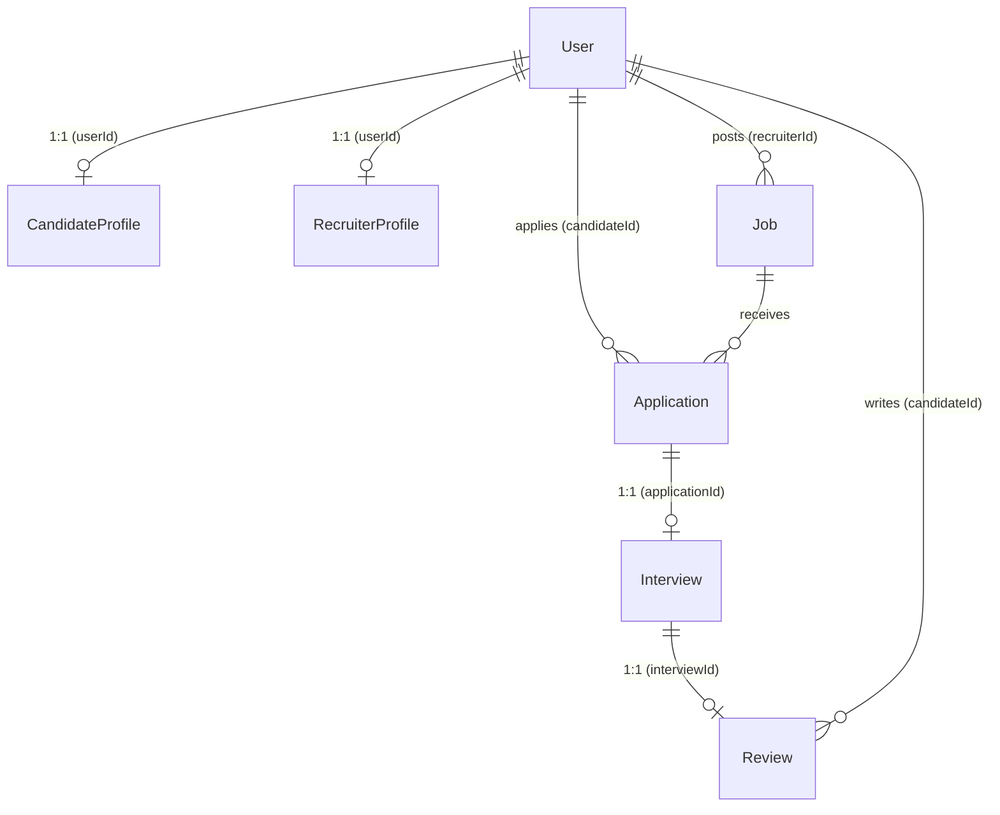

<div align="center">

# AbleUp

### An inclusive-employment marketplace connecting Persons with Disabilities to verified, accessibility-committed employers.

[](https://react.dev/)
[](https://vitejs.dev/)
[](https://nodejs.org/)
[](https://expressjs.com/)
[](https://www.mongodb.com/)
[](https://zod.dev/)
[](https://jwt.io/)

</div>

---

## Overview

On a general job board, a disabled candidate has no way to tell whether "inclusive workplace" means a ramp actually exists or that someone just typed the words. **AbleUp** answers that with three design principles baked into the entire system:

- **Two-sided human verification** — candidates upload their government **UDID** card or disability certificate and cannot apply until an admin approves them; companies upload incorporation/GST proof and cannot post jobs until an admin approves them.
- **Closed accessibility vocabularies** — every job declares concrete accessibility arrangements from a fixed vocabulary (not free text), and that same vocabulary describes what a candidate needs, so the two sides can actually be **matched and compared**.
- **Earned reputation** — a company's public rating comes from one place only: reviews written by candidates who **attended a real interview** with them.

> **Naming note:** the product is "AbleUp"; the codebase and demo data spell it `AbelUp` (package names, email domains, `abelup_*` localStorage keys). They refer to the same thing.

---

## Key Features

| Area           | Highlights                                                                                                                                                                                        |
| -------------- | ------------------------------------------------------------------------------------------------------------------------------------------------------------------------------------------------- |
| **Candidates** | UDID-verified profiles, disability-aware job search with skill-match scoring, one-click apply (verified only), interview responses, interview-gated company reviews                               |
| **Recruiters** | Multi-step company onboarding wizard, document-backed verification, job posting with mandatory accessibility features, applicant management, single + bulk shortlist/reject, interview scheduling |
| **Admins**     | Two verification queues (candidate + company) with inline document review, user provisioning with temp passwords, forced password resets, bulk company approval                                   |
| **Platform**   | JWT stateless auth, role-based access control, private document storage behind an ownership check, best-effort transactional email, bilingual UI (EN / हिन्दी), accessibility-first components    |

---

## Architecture

A classic **decoupled SPA + REST API + document database**, with file storage and email as side-channels.

```mermaid
flowchart LR
    subgraph Client["React SPA (Vite, :8080)"]
      UI[Pages + shadcn/ui]
      Ctx[AuthContext<br/>localStorage]
      API[lib/api.js<br/>fetch + Bearer]
      UI --> Ctx
      UI --> API
    end

    subgraph Server["Express API (:5002, /api)"]
      MW[Helmet → Logger → CORS → JSON → RateLimit ×3]
      Routes[Routers: auth / candidate / recruiter<br/>jobs / interviews / reviews / admin / documents]
      Auth[auth → requireRole → requireVerified]
      Valid[validate&#40;zodSchema&#41;]
      Ctrl[Controllers]
      Svc[Services: recruiterProfile<br/>review · cascade]
      MW --> Routes --> Auth --> Valid --> Ctrl --> Svc
    end

    DB[(MongoDB<br/>Mongoose ODM)]
    Public[/uploads — public static<br/>logos, resumes/]
    Private[/private/verification<br/>UDID + company proof/]
    SMTP[[Nodemailer → SMTP]]

    API -- JSON over HTTPS --> MW
    Ctrl --> DB
    Ctrl --> Public
    Ctrl --> Private
    Ctrl -. best-effort .-> SMTP
```



**Request pipeline** (every `/api` call): `Helmet → Logger → CORS → JSON → health hoist → rate limits (auth / write / api) → auth → requireRole → requireVerified → validate(zod) → controller → errorHandler`. The ordering is deliberate — verification is checked _before_ multer runs on the apply route (no orphaned uploads on rejection), and `validate()` replaces the request body with the parsed result so controllers can't be mass-assigned server-owned fields.

### File storage — two tiers

| Tier        | Path                     | Served by                      | Contents                                                                       |
| ----------- | ------------------------ | ------------------------------ | ------------------------------------------------------------------------------ |
| **Public**  | `./uploads`              | `express.static`               | Company logos, resumes                                                         |
| **Private** | `./private/verification` | `GET /api/documents/:filename` | UDID cards, disability certificates, government IDs, incorporation & GST proof |

Sensitive identity documents live outside the static root and are reachable only through an authenticated handler that verifies the caller owns the document or is an admin — returning **404 rather than 403** on an unauthorized read so the endpoint can't be used to probe for other people's files.

---

## Tech Stack

**Backend** — Node.js (native ESM, no build step) · Express · MongoDB + Mongoose · JWT · bcrypt (cost 12) · Zod (boundary + env validation) · Helmet · express-rate-limit · Multer · Nodemailer

**Frontend** — React 18 + Vite (SWC) · React Router v6 · shadcn/ui (Radix + Tailwind) · Context API for auth · hand-rolled `fetch` layer · i18next (EN / HI)

> **Why these choices:** shadcn/Radix ships correct ARIA, focus management and keyboard handling out of the box — a requirement for an accessibility product, not a nicety. Closed enums feed _both_ the Mongoose schema and the Zod validator from a single source, so the API can't accept a value the database would reject.

---

## Data Model

Seven MongoDB collections. `Job`, `Application`, `Interview`, and `Review` reference the `User` collection; `CandidateProfile` and `RecruiterProfile` are 1:1 side tables — keeping the auth record small and hot while pushing role-specific detail into profiles.



A few modelling decisions worth noting:

- **Derived over stored, where a copy could lie** — `Application.shortlisted` is a virtual off `status`; `Review.isVerifiedHire` is computed from the live application status. Two stored copies of one fact eventually disagree.
- **One owner per denormalised counter** — `cascadeService` owns `Job.applicantsCount`; `reviewService` owns the review aggregates. `npm run db:repair` proves zero drift.
- **Shared vocabularies** live in `backend/src/constants/`, are enforced as both Mongoose _and_ Zod enums, and are mirrored to the frontend; `npm run check:constants` fails if the two sides drift.

---

## Getting Started

### Prerequisites

- Node.js (with ESM support)
- A MongoDB connection string (Atlas or local)

### Backend — `http://localhost:5002`

```bash
cd backend
npm install
cp .env.example .env          # then set MONGO_URI + JWT_SECRET
npm run seed -- --yes         # seeds one candidate, recruiter, and admin (all verified)
npm run dev                   # node --watch src/server.js
```

### Frontend — `http://localhost:8080`

```bash
cd frontend
npm install
cp .env.example .env          # VITE_API_URL must match the backend PORT
npm run dev
```

> Both `.env` files are gitignored — the checked-in `.env.example` on each side is the only committed record of a working configuration. The API port must agree across `backend/.env` and `frontend/.env`.

### Demo credentials

All accounts use the password `Password@123`:

| Role      | Email                   |
| --------- | ----------------------- |
| Candidate | `candidate@ableup.test` |
| Recruiter | `recruiter@ableup.test` |
| Admin     | `admin@ableup.test`     |

Run `npm run seed -- --yes --pending-recruiter` to leave the recruiter unverified so the onboarding wizard and the admin recruiter queue are both reachable.

---

## Core Flows

<details>
<summary><b>Candidate: register → verify → apply</b></summary>

A candidate self-registers as `PENDING`, can browse and save jobs but sees "Verify to Apply", uploads their UDID card to a private directory, and an admin reviews the document inline before approving. Only then does `requireVerifiedCandidate` let them apply — creating an `Application`, incrementing `applicantsCount` via `cascadeService`, and firing a confirmation email.

</details>

<details>
<summary><b>Recruiter: onboard → verify → post</b></summary>

A recruiter completes a five-step onboarding wizard (persisted per step), submits for review (a 400 lists exactly what's missing), and an admin verifies the company against its documents. `requireVerifiedRecruiter` then unlocks job posting — where declaring at least one accessibility feature from the shared enum is mandatory.

</details>

<details>
<summary><b>Application → shortlist → interview → review</b></summary>

A recruiter shortlists an applicant and schedules an interview (only `SHORTLISTED` applications qualify). The candidate accepts; once the scheduled time passes, `reviewService.isInterviewReviewable` authorizes a one-per-interview review, and `recomputeRecruiterRating` recomputes the company's aggregates from the full review set.

</details>

---

## Project Structure

```
backend/
  src/
    config/        env.js, db.js  (env is Zod-validated at startup, fail-fast)
    constants/     shared vocabularies (roles, statuses, disability & accessibility enums)
    middleware/    auth · requireVerified · upload · validate · errorHandler
    models/        7 collections + shared VerificationDocument subschema
    controllers/   recruiter surface split: jobs vs. profile lifecycle
    routes/        auth · candidate · recruiter · jobs · interviews · reviews · admin · documents
    services/      recruiterProfile · review · cascade
    validators/    Zod DTOs
    scripts/       db:sync-indexes · db:repair · check:constants
    server.js · seed1.js
frontend/
  src/
    context/       AuthContext (normalizes backend shape at the boundary)
    lib/           api.js (the whole data layer) · navigation.js
    hooks/         useRecruiterProfile
    pages/ components/ constants/ i18n/
```

---

## Maintenance Commands

| Command                   | Purpose                                                  |
| ------------------------- | -------------------------------------------------------- |
| `npm run db:sync-indexes` | Create missing indexes and drop undeclared ones          |
| `npm run db:repair`       | Recompute denormalised counters (`--dry` to report only) |
| `npm run check:constants` | Fail if the backend and frontend option lists drift      |

---

## Roadmap & Known Gaps

This project ships with an honest account of its trade-offs:

- **Testing** — the frontend has Vitest configured; the backend has no test tooling yet. Highest-priority tests: the verification gates, document ownership check, review eligibility, and cascade teardowns.
- **Transactions** — multi-document writes (registration, apply, deletions) aren't atomic on a standalone `mongod`; moving to a replica set would allow `withTransaction`.
- **Object storage** — uploads currently hit local disk; `resolveFileUrl`/`fetchProtectedFile` already isolate every call site so a move to signed-URL object storage needs no call-site edits.
- **Unreachable states** — `Application.HIRED` and some `Interview` statuses are modelled but not yet wired to endpoints.
- **i18n coverage** — the plumbing is complete; threading `t()` through all pages is in progress.

---

## License

Add your license of choice (e.g. MIT) here.
