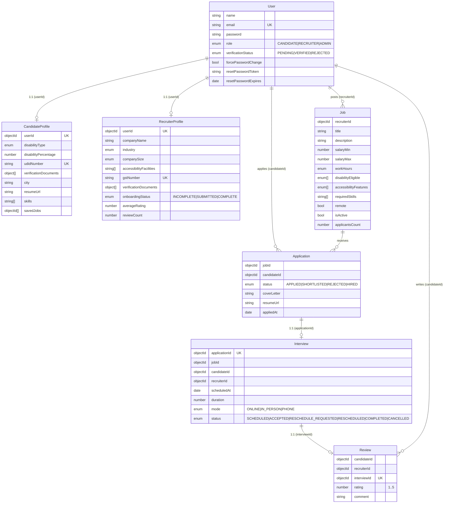
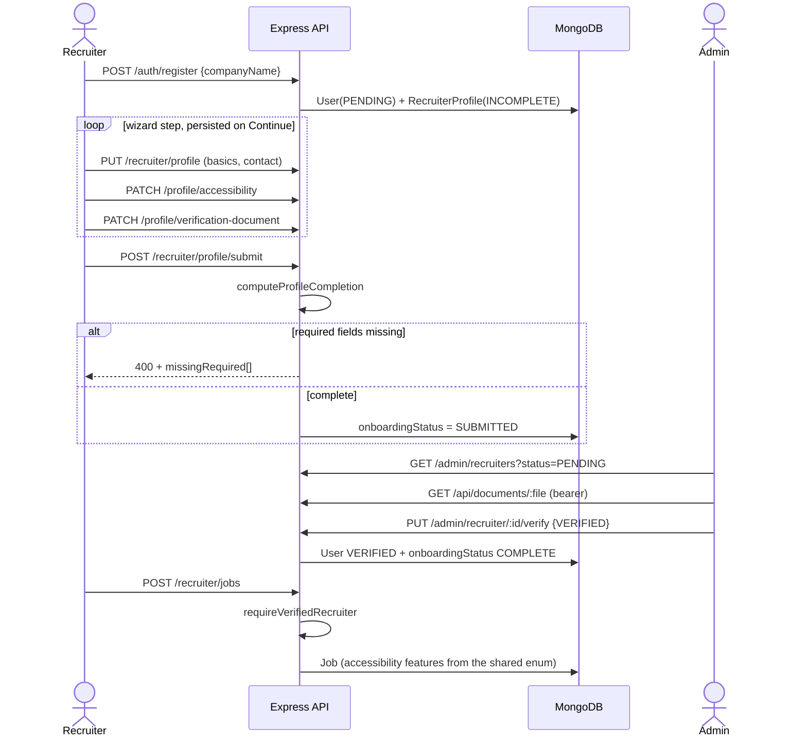
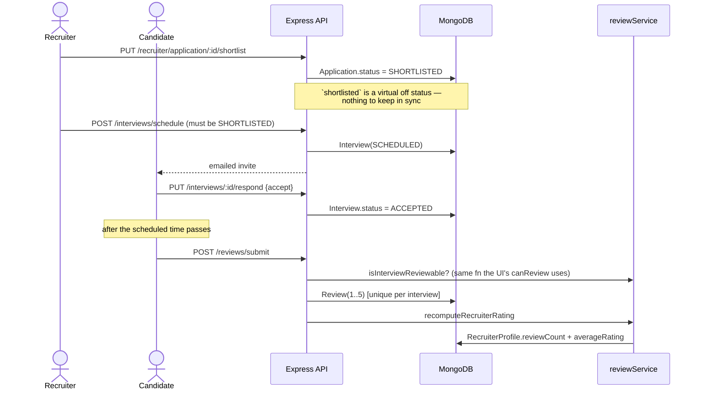
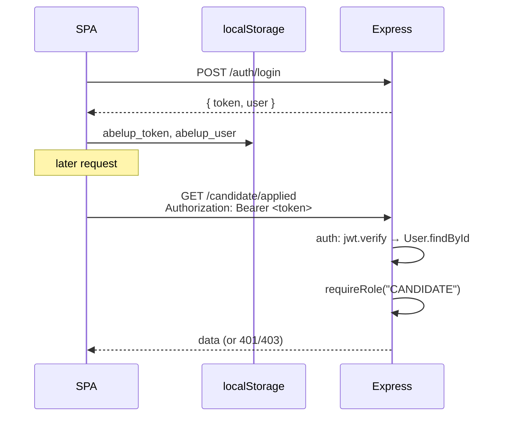

# AbleUp — End-to-End Architecture & Design

> A full-stack **inclusive-employment marketplace** connecting Persons with Disabilities (PwD) to verified, accessibility-committed employers. This document is the single source of truth for the project's domain, architecture, data model, backend, frontend, runtime flows, and design trade-offs — written so it can be used to explain the project in interviews.

> **Naming note:** the product is "AbleUp"; the codebase and demo data spell it **`AbelUp`** (package names, email domains, localStorage keys `abelup_*`). They refer to the same thing.

---

## Table of Contents

1. [Overview & Problem Domain](#1-overview--problem-domain)
2. [High-Level Architecture](#2-high-level-architecture)
3. [Tech Stack & Key Decisions](#3-tech-stack--key-decisions)
4. [Data Schema](#4-data-schema)
5. [Backend Implementation](#5-backend-implementation)
6. [Frontend Implementation](#6-frontend-implementation)
7. [End-to-End Flows](#7-end-to-end-flows)
8. [Trade-offs, Known Gaps & What I'd Improve](#8-trade-offs-known-gaps--what-id-improve)
9. [Interview Cheat-Sheet](#9-interview-cheat-sheet)

> **Bugs fixed along the way** — symptom, root cause, fix and takeaway for every defect
> this project hit — live in [BUGS.md](BUGS.md). This document describes the system as it
> stands; that one describes how it got there.

---

## 1. Overview & Problem Domain

**Elevator pitch (reusable):**

> AbleUp is a job marketplace built specifically for Persons with Disabilities in India. Both sides of the market are verified by a human before they can transact: candidates upload their government **UDID** card or disability certificate and cannot apply until an admin approves them; companies upload incorporation or GST proof and cannot post jobs until an admin approves them. Every job must declare concrete accessibility arrangements drawn from a fixed vocabulary — not free text — and that same vocabulary describes what a candidate needs, so the two can actually be matched. A company's public reputation comes from one place only: reviews written by candidates who attended a real interview with them.

**The problem it addresses.** On a general job board, a disabled candidate cannot tell whether "inclusive workplace" means a ramp exists or that someone typed the words. The design response runs through the whole system: claims are drawn from closed vocabularies rather than prose, identity on both sides is checked by a human against documents, and reputation is earned from attended interviews rather than self-declaration.

### Actors / Roles

| Role | How created | Core capabilities |
|---|---|---|
| **CANDIDATE** | Self-register (starts `PENDING`) | Build profile (UDID number, disability type, skills, resume, location), upload verification documents, search and save jobs, **apply once VERIFIED**, respond to interview invites, review recruiters after attending an interview |
| **RECRUITER** | Self-register (starts `PENDING`) | Complete company onboarding, upload verification documents, submit for review, **post jobs once VERIFIED**, review applicants, shortlist/reject (single + bulk), schedule and reschedule interviews |
| **ADMIN** | Seeded or created by another admin (cannot self-register) | Work both verification queues — reading the submitted documents and approving or rejecting with a reason — list users, provision users with temp passwords, force password resets |

### Domain concepts unique to this product

- **Two-sided verification.** Neither role is trusted on signup. `verificationStatus === "VERIFIED"` is a hard precondition to apply (candidates) and to post (recruiters), enforced by `requireVerifiedCandidate` / `requireVerifiedRecruiter` rather than by the UI.
- **Documents as evidence, not decoration.** UDID cards, disability certificates and incorporation papers are uploaded to a private directory and served only through an authenticated route to their owner and to admins. A recruiter cannot submit for verification without attaching at least one — an approval with nothing to inspect is the gate doing nothing.
- **Closed accessibility vocabularies.** `Job.accessibilityFeatures`, `Job.disabilityEligible` and `CandidateProfile.disabilityType` are schema enums sourced from `backend/src/constants/`. Free text here was the original sin: a recruiter typing "wheelchair ok" and a candidate declaring "Locomotor Disability" can never be matched, and unconstrained claims cannot be compared between employers.
- **Interview-gated reviews.** A candidate can review a company only for an interview they accepted and whose scheduled time has passed. That single rule (`reviewService.isInterviewReviewable`) is what keeps the reputation signal honest, and it is evaluated server-side for both the write and the "can I review this?" flag the UI renders.

---

## 2. High-Level Architecture

Classic **decoupled SPA + REST API + document database**, plus two side-channels (file storage and email).

```mermaid
flowchart LR
    subgraph Client["React SPA (Vite, :8080)"]
      UI[Pages + shadcn/ui]
      Ctx[AuthContext<br/>localStorage: abelup_token/user]
      API[lib/api.js<br/>fetch + Bearer]
      UI --> Ctx
      UI --> API
    end

    subgraph Server["Express API (:5002, /api)"]
      MW[Helmet → Morgan → CORS → JSON → RateLimit ×3]
      Routes[Routers: auth / candidate / recruiter<br/>jobs / interviews / reviews / admin / documents]
      Auth[auth → requireRole → requireVerified]
      Valid[validate&#40;zodSchema&#41;]
      Ctrl[Controllers]
      Svc[Services: recruiterProfile<br/>review · cascade]
      MW --> Routes --> Auth --> Valid --> Ctrl --> Svc
    end

    DB[(MongoDB<br/>Mongoose ODM)]
    Public[/uploads — public static<br/>logos, resumes/]
    Private[/private/verification<br/>UDID + company proof/]
    SMTP[[Nodemailer → SMTP]]

    API -- JSON over HTTPS --> MW
    Ctrl --> DB
    Ctrl --> Public
    Ctrl --> Private
    Ctrl -. best-effort .-> SMTP
```



### Request lifecycle (every `/api` call)

```
Helmet (security headers)
  → morgan → winston   (above the limiters on purpose: morgan logs on response
                        "finish", so anything short-circuiting above it — every
                        429, every preflight — would never be recorded)
  → CORS (origin: true, credentials, maxAge 600)
  → express.json()
  → GET /api/health        (hoisted above the limiters so uptime monitors
                            cannot exhaust the API budget)
  → auth limiter           (/api/auth/{login,register,forgot-,reset-password},
                            10 / 15 min / IP, failures only)
  → write limiter          (/api/, 30 / min / IP, non-GET only)
  → api limiter            (/api/, 600 / 15 min / IP)
  → router match
  → auth middleware        (verify JWT, load req.user)    [protected routes]
  → requireRole(...)       (403 if role not allowed)      [role-scoped routes]
  → requireVerified...     (403 until an admin approves)  [apply / post-job]
  → validate(schema)       (Zod: parse, coerce, strip unknown keys → 400)
  → controller             (known-good data → Mongoose → response)
  → errorHandler           (last; Zod / Mongoose ValidationError / CastError
                            / duplicate-key all normalise to 4xx, not 500)
```

The ordering is the point. Verification is checked **before** multer runs on the apply route, so a rejected application no longer leaves an orphaned resume on disk; and `validate()` replaces the body with the parsed result, so controllers cannot be mass-assigned fields the DTO does not list.

### File storage — two tiers

| Tier | Path | Served by | Contents |
|---|---|---|---|
| Public | `./uploads` | `express.static` | Company logos, resumes |
| Private | `./private/verification` | `GET /api/documents/:filename` | UDID cards, disability certificates, government IDs, incorporation and GST proof |

The split exists because `express.static` has no notion of who is asking. That is acceptable for a company logo and unacceptable for a disabled person's medical documentation, so those files are stored outside the static root entirely and reached only through a handler that checks the caller either owns the document or is an admin. The stored URL is `/api/documents/<file>`, which means the client cannot use a plain `` — it fetches with its bearer token and renders from an object URL.

**Email:** transactional mail (welcome, shortlist, interview scheduled/accepted/reschedule, verification outcome, password reset) goes through Nodemailer as a **best-effort side-channel** — a missing SMTP config makes the mailer a silent no-op, so the core flow never breaks.

**Health:** `GET /api/health` returns `{ status: "ok", timestamp }` with no auth — the one endpoint that answers "is the API up?" without needing a token, which is also the fastest way to check that the frontend is pointed at the right port.

---

## 3. Tech Stack & Key Decisions

### Backend

| Choice | Why (interview framing) |
|---|---|
| **Plain JavaScript, validated at runtime** | The project carries no type system; correctness is enforced where the data actually arrives. The option lists (roles, statuses, disability types, accessibility features) are single arrays that feed **both** the Mongoose enum and the Zod enum, so the API still cannot accept a value the schema will reject — but that is now a runtime rejection rather than a compile-time one, and the single-source-of-truth is a convention rather than something the compiler enforces. `npm run check:constants` is what holds the two sides together (see §5). |
| **Express** | Minimal, well-understood; middleware pipeline maps cleanly onto the cross-cutting concerns (security, auth, rate limiting, error handling). |
| **No build step, no dev dependencies** | Since `tsc` is gone, Node runs `src/` directly — which means native ESM (`"type": "module"`, explicit `.js` on every relative import, `__dirname` reconstructed from `import.meta.url`). `npm run dev` is `node --watch src/server.js`; there is no nodemon, no bundler, and no `devDependencies` block at all. The cost is that there is also no test runner or linter on this side — see [§8](#8-trade-offs-known-gaps--what-id-improve). |
| **MongoDB + Mongoose** | The domain is document-shaped and array-heavy — a job has `accessibilityFeatures[]`, `disabilityEligible[]`, `requiredSkills[]`; a candidate has `skills[]`, `savedJobs[]`. Schemaless-but-validated fits better than rigid relational tables, and Mongoose gives me schema validation + indexes on top. |
| **JWT (stateless auth)** | No server session store to scale; the token carries `{ id }`, the middleware re-loads the user each request so role/verification changes take effect immediately. |
| **bcrypt (cost 12)** | Industry-standard adaptive password hashing. |
| **Zod (at the boundary)** | Every route body goes through `validate(schema)`, which parses, coerces and **strips unknown keys** — that stripping is what prevents mass-assignment of server-owned fields like `averageRating` or `recruiterId`. Also validates the process environment at startup, so misconfiguration fails fast. Schema-level rules in Mongoose duplicate the important bounds deliberately: the seed and any direct write bypass HTTP entirely. |
| **Helmet + express-rate-limit** | Baseline hardening: secure headers and 100 req / 15 min / IP throttling to blunt brute-force and abuse. |
| **Multer** | Streams uploads to disk with type and size guards — resumes (PDF/DOC/DOCX, ≤5 MB), logos (JPG/PNG/WEBP, ≤2 MB) and verification documents (PDF/JPG/PNG, ≤5 MB, private directory). Checks extension **and** MIME type; extension alone is defeated by renaming a file. |
| **Nodemailer** | Transactional email, decoupled and best-effort so email outages don't fail core requests. |

### Frontend

| Choice | Why (interview framing) |
|---|---|
| **React 18 + Vite (SWC)** | Fast dev server / HMR and near-instant builds via the SWC compiler. |
| **React Router v6** | Declarative routing with a small `ProtectedRoute` wrapper for auth + role gating. |
| **shadcn/ui (Radix + Tailwind)** | For an *accessibility-focused product*, this matters: Radix primitives ship correct ARIA, focus management, and keyboard handling out of the box. Tailwind theming is fully CSS-variable/HSL-token driven (supports dark mode + semantic `success`/`warning` tokens). |
| **Context for auth state** | The only truly global state is "who is logged in." A single `AuthContext` backed by `localStorage` is proportionate — no Redux/Zustand overhead for one concern. |
| **Hand-rolled `fetch` layer** | A ~50-line `api()`/`apiUpload()` wrapper injects the Bearer token and normalizes errors — no need for axios for this surface area. |
| **i18next (EN / हिन्दी)** | The product targets India; Hindi support broadens reach. Language is auto-detected and persisted in `localStorage`. |

> **Honest note:** several client dependencies are Lovable.dev template scaffolding that never got wired up. `@tanstack/react-query` is mounted in `App.jsx` but there is **not one `useQuery`/`useMutation` call** in the codebase — data fetching is imperative `useEffect` + `useState`. `react-hook-form` is imported only by `components/ui/form.jsx`, which nothing imports; `@hookform/resolvers` and `next-themes` have zero imports anywhere. `zod` **is** used, but standalone — `hooks/useRecruiterProfile.js` defines `companyProfileSchema` and validates per field with `safeParse` rather than through a form library. Called out fully in [§8](#8-trade-offs-known-gaps--what-id-improve).

---

## 4. Data Schema

Seven MongoDB collections. A deliberate design choice: **`Job`, `Application`, `Interview`, and `Review` reference the `User` collection** (via `recruiterId` / `candidateId`), while `CandidateProfile` and `RecruiterProfile` are **1:1 side tables** looked up separately by `userId`. This keeps the auth/identity record (`User`) small and hot, and pushes role-specific detail into profiles.



### Schema conventions

Every schema spreads `baseSchemaOptions` from `backend/src/models/schemaOptions.js`, which fixes the convention in one place:

- **`timestamps: true`** on all seven collections. `Application` renames the created field via `timestamps: { createdAt: "appliedAt" }` to keep its domain name. There are no hand-managed date fields left.
- **`versionKey: false`** and a `toJSON` transform that drops `_id` in favour of `id`, so every model serialises identically.
- **`User`** overrides the transform to strip `password`, `resetPasswordToken` and `emailVerificationToken`; those paths are additionally `select: false`, so reading them requires an explicit `.select("+password")`.

Shared vocabularies live in `backend/src/constants/` (`company.js`, `candidate.js`, `job.js`, `verification.js`), are enforced as schema enums *and* Zod enums, and are mirrored in `frontend/src/constants/company.js`. `npm run check:constants` fails if the two sides drift.

Two caches are denormalised, each with exactly one writer:

| Field | Owner | Repair |
|---|---|---|
| `Job.applicantsCount` | `services/cascadeService` (both directions) | `npm run db:repair` |
| `RecruiterProfile.reviewCount` / `averageRating` | `services/reviewService` | `npm run db:repair` |

`Application.shortlisted` is a **virtual** derived from `status`, not a stored field; `Review.isVerifiedHire` is computed per request from the application's current status. Both used to be stored copies that could disagree with their source.

`npm run db:sync-indexes` creates missing indexes and drops ones no longer declared — Mongoose's `autoIndex` only ever does the former.

### Collection details

Every collection also carries `createdAt` / `updatedAt` from `timestamps: true`; only the non-obvious fields and indexes are listed below.

**`User`** — identity & auth
- `name` *(req, 2–100)*, `email` *(req, **unique**, `lowercase` + `trim`)*, `password` *(req, bcrypt hash, `select: false`)*
- `role`: `CANDIDATE | RECRUITER | ADMIN` *(req)*
- `verificationStatus`: `PENDING | VERIFIED | REJECTED` *(default `PENDING`)*
- `rejectionReason?`, `resetPasswordToken?`, `resetPasswordExpires?`, `emailVerificationToken?` *(all `select: false`)*, `isEmailVerified` *(default false)*, `forcePasswordChange` *(default false)*
- Indexes: `{ role, verificationStatus, createdAt: -1 }` for the admin queues; sparse indexes on both token fields. **No TTL index** on `resetPasswordExpires` — TTL deletes the document, i.e. the account; tokens are cleared on use.

**`CandidateProfile`** — 1:1 with User
- `userId` → `User` *(**unique, required**)*
- `disabilityType` *(enum `DISABILITY_TYPES`)*, `disabilityPercentage` *(0–100)*, `udidNumber` *(**unique + sparse** — the government disability ID)*
- `phone`, `city`, `state`, `country` — brought to parity with RecruiterProfile
- `preferredWorkHours` *(enum `WORK_HOUR_OPTIONS`, shared with `Job.workHours`)*, `resumeUrl`
- `verificationDocuments: [VerificationDocument]` — the shared embedded subdocument, replacing a loose `udidDocumentUrl` string
- `skills: [String]`, `savedJobs: [ObjectId → Job]`

**`RecruiterProfile`** — 1:1 with User; the reputation record
- `userId` → `User` *(**unique, required**)*, `companyName` *(req, 2–200)*, `companyLogo`, `website`, `companyEmail` *(`lowercase`)*, `linkedin`
- `industry` *(enum `INDUSTRIES`)*, `companySize` *(enum `COMPANY_SIZES`)*, `foundedYear` *(1800–now)*, `companyDescription`, `mission`, `vision`
- `hrContactPerson`, `hrContactNumber`, `companyAddress`, `city`, `state`, `country`
- `accessibilityFacilities` *(enum `COMPANY_ACCESSIBILITY_FACILITIES`)*
- `gstNumber` *(**unique + sparse**, `uppercase` so casing cannot create a second "unique" registration)*, `verificationDocuments: [VerificationDocument]`, `onboardingStatus` *(indexed)*, `submittedForVerificationAt`
- `reviewCount`, `averageRating` *(default 0; owned by `services/reviewService`)*

**`Job`**
- `recruiterId` → `User` *(req)*, `title` *(req, 3–150)*, `description` *(req, 20–10000)*
- `salaryMin`, `salaryMax` *(both ≥ 0; a `pre("validate")` hook enforces `salaryMax >= salaryMin`)*
- `workHours` *(enum `WORK_HOUR_OPTIONS`)*, `location`, `remote` *(default false)*
- `disabilityEligible` *(enum `DISABILITY_TYPES` — the same vocabulary `CandidateProfile.disabilityType` uses, which is what makes matching possible)*, `accessibilityFeatures` *(enum `JOB_ACCESSIBILITY_FEATURES`)*, `requiredSkills: [String]`
- `isActive` *(default true)*, `applicantsCount` *(default 0, ≥ 0; owned by `services/cascadeService`)*
- Indexes: `{ isActive, createdAt: -1 }` for the public list, `{ recruiterId, isActive, createdAt: -1 }` for every recruiter-scoped list, and a **text index** on `{ title, description }` backing search.

**`Application`**
- `jobId` → `Job`, `candidateId` → `User`
- `status`: `APPLIED | SHORTLISTED | REJECTED | HIRED` *(default `APPLIED`)* — the single source of truth
- `shortlisted` — **virtual**, `status === "SHORTLISTED"`. Present in every API response, absent from Mongo, so it cannot be filtered on; queries use `{ status: "SHORTLISTED" }`.
- `shortlistReason`, `shortlistedBy` → `User`, `coverLetter`, `resumeUrl`
- `appliedAt` is `createdAt` under a domain name.
- Indexes: **unique compound** `{ jobId, candidateId }` — one application per candidate per job, and the only real guard against a double apply; `{ candidateId, appliedAt: -1 }`; `{ jobId, status, appliedAt: -1 }`.

**`Interview`** — 1:1 with Application; a small state machine
- `applicationId` → `Application` *(**unique**)*, `jobId`, `candidateId`, `recruiterId` (all → `User`/`Job`)
- `scheduledAt` *(req)*, `duration` *(minutes, default 30, 15–480)*, `mode`: `ONLINE | IN_PERSON | PHONE` *(default `ONLINE`)*, `location`, `notes`
- `status`: `SCHEDULED | ACCEPTED | RESCHEDULE_REQUESTED | RESCHEDULED | COMPLETED | CANCELLED` *(default `SCHEDULED`)*, `candidateMessage`
- Indexes: `{ applicationId }` *(unique)*, `{ recruiterId, scheduledAt }` and `{ candidateId, scheduledAt }` — both interview lists filter by one party and sort by time — plus `index: true` on `jobId` for the per-job lookups.

**`Review`** — 1:1 with Interview (interview-gated)
- `candidateId`, `recruiterId`, `interviewId` → `Interview` *(**unique** — one review per interview)*
- `rating` *(req, **1–5**)*, `comment` *(req, 10–2000)*
- `isVerifiedHire` is **not stored** — it is derived per request from the application's current status by `reviewService.withVerifiedHireFlag`.
- Indexes: `{ recruiterId, createdAt: -1 }`, `{ candidateId, createdAt: -1 }`.

---

## 5. Backend Implementation

Structure: `config/` (`env.js`, `db.js`), `constants/` (shared vocabularies, plus an `index.js` barrel — native ESM has no directory resolution, so it is imported as `../constants/index.js`), `middleware/` (`auth.js`, `requireVerified.js`, `upload.js`, `validate.js`, `errorHandler.js`), `models/`, `controllers/`, `routes/`, `services/`, `validators/` (Zod DTOs), `utils/` (`mailer.js`, `apiResponse.js`), `scripts/` (db maintenance), plus `server.js` and `seed1.js`. There is **no build step** — Node runs the source directly.

Two structural notes: `models/verificationDocument.js` is an embedded **subschema**, not a model (shared by both profile schemas), and the recruiter surface is split across two controllers — `recruiterController.js` (jobs, applicants, shortlisting) and `recruiterProfileController.js` (company profile, documents, onboarding submit) — because they are two different lifecycles that happen to share a route prefix.

### Auth — `/api/auth`

| Method | Path | Protection | Purpose |
|---|---|---|---|
| POST | `/register` | public | Register CANDIDATE or RECRUITER (**ADMIN blocked, 403**) |
| POST | `/login` | public | Returns JWT + user summary |
| POST | `/forgot-password` | public | Email a reset link (anti-enumeration) |
| POST | `/reset-password` | public | Consume token, set new password |
| GET | `/verify-email/:token` | public | Email verification (currently dormant) |
| GET | `/me` | `auth` | Current user — what the client's `refreshUser()` calls |
| POST | `/change-password` | `auth` | Change password (clears `forcePasswordChange`) |
| DELETE | `/delete-account` | `auth` | Password-confirmed account deletion + cascade |

Key rules:
- **Hashing:** `bcrypt.hash(pw, 12)` everywhere. `password` is `select: false`, so the four paths that compare a hash opt in with `.select("+password")` and every other read of a User simply cannot leak it.
- **JWT:** `jwt.sign({ id }, secret, { expiresIn: "7d" })` — payload is intentionally minimal; the middleware re-loads the full user each request, so a verification or role change takes effect on the next call rather than at token expiry.
- **Verification defaulting:** both roles start `PENDING`. Recruiters used to self-verify; they no longer do, which is what makes the recruiter queue meaningful.
- **Registration side effects:** creates the role profile (`CandidateProfile` or `RecruiterProfile`) and fires a best-effort welcome email. The two writes are not transactional — see [§8](#8-trade-offs-known-gaps--what-id-improve) — so a failed profile create compensates by deleting the user rather than stranding an account that can never be onboarded.
- **Forgot/reset:** `/forgot-password` always returns a generic success (no account enumeration); if the user exists it stores a `crypto.randomBytes(32)` hex token with a **1-hour expiry** and emails a link to `${FRONTEND_URL}/reset-password?token=...`. Email is normalised (`lowercase` + `trim`) at the schema, so a differently-cased address resolves to the same account — it did not, and the reset silently went nowhere.
- **Force-password-change:** admin-provisioned accounts get `forcePasswordChange: true`, cleared on the next password change/reset.

### Middleware composition
- `auth` reads `Authorization: Bearer <token>`, verifies it, loads the user and attaches `req.user`; any failure → `401`.
- `requireRole(...roles)` → `403` unless `req.user.role` is allowed. Routers compose them: `router.use(auth, requireRole("CANDIDATE"))`.
- `requireVerifiedCandidate` / `requireVerifiedRecruiter` → `403` until an admin has approved the account. Applied per route, not per router, because a pending recruiter must still be able to read and finish their own profile.
- `validate(schema, source?)` parses `req.body` (or query/params) and **replaces it** with the parsed result.

### The response envelope — why the client can branch on a reason

`utils/apiResponse.js` fixes the shape every handler returns:

- `ok(res, payload, status = 200)` → `{ success: true, ...payload }`
- `fail(res, status, message, code)` → `{ success: false, message, code }`
- `class ApiError` with `badRequest` / `unauthorized` / `forbidden` / `notFound` / `conflict` statics, each carrying a `statusCode` and a machine-readable `code`; thrown from anywhere and normalised by `errorHandler`.

The `code` is the point. A 403 on "post a job" has four distinct causes, and `requireVerified.js` names each one — `RECRUITER_PROFILE_INCOMPLETE` (finish onboarding), `RECRUITER_REJECTED` (echoes `rejectionReason`), `RECRUITER_NOT_VERIFIED` (wait for an admin), and `CANDIDATE_NOT_VERIFIED` on the apply route. That vocabulary is the server half of the contract the client relies on in `lib/api.js`: `ApiError` carries `code` through, so the UI branches on the reason instead of matching message substrings and can render "you're still in the queue" differently from "your submission was rejected, here's why."

Errors that reach `errorHandler` unclassified get the same treatment: Zod → `VALIDATION_ERROR`, Mongoose `CastError` → `INVALID_ID`, duplicate key `11000` → `DUPLICATE_KEY` naming the field.

### Candidate — `/api/candidate` *(all routes: `auth` + `CANDIDATE`)*

| Method | Path | Purpose |
|---|---|---|
| GET | `/profile` / PUT `/profile` | Read / update profile — disability type & percentage, UDID, phone, city/state/country, work-hour preference, skills |
| GET | `/applied` | Paginated applications, job fields populated |
| GET | `/saved` | Populated saved jobs |
| POST | `/save/:jobId` | Toggle a saved job → `{ saved: true/false }` |
| POST | `/apply/:jobId` | **Apply (VERIFIED only)** |
| POST | `/resume` | Upload resume (multipart) |
| POST | `/verification-document` | Upload a UDID card / disability certificate (multipart) |
| DELETE | `/verification-document` | Detach a document and delete the file |

- **Apply is the gated action:** `requireVerifiedCandidate` runs before multer, the job must exist and be active, duplicates are blocked by the unique `{ jobId, candidateId }` index, the resume resolves from upload → body → profile, then it creates the `Application`, increments `applicantsCount` through `cascadeService`, and emails a confirmation.
- **Document uploads validate `docType` inside the handler**, not via `validate()` middleware — multipart fields do not exist until multer has parsed the request.

### Recruiter — `/api/recruiter` *(all routes: `auth` + `RECRUITER`)*

| Method | Path | Purpose |
|---|---|---|
| GET | `/profile` / PUT `/profile` | Read / update the company profile |
| PATCH | `/profile/accessibility` | Set company-wide accessibility facilities |
| PATCH | `/profile/logo` | Upload a company logo (multipart) |
| PATCH | `/profile/verification-document` | Upload incorporation / GST / PAN proof (multipart) |
| DELETE | `/profile/verification-document` | Detach a document and delete the file |
| POST | `/profile/submit` | Submit for admin review (400 lists what is missing) |
| GET | `/dashboard/stats` | One request for every dashboard number |
| GET | `/jobs` | Own jobs (`?active=true`), each annotated with `shortlistedCount` |
| POST | `/jobs` | **Create job — VERIFIED only, ≥1 accessibility feature required** |
| GET | `/job/:jobId/applicants` | Applicants (ownership-checked, paginated, status filter) |
| GET | `/job/:jobId/summary` | Applicant / shortlisted counts |
| PUT | `/application/:id/shortlist` | Shortlist or reject → best-effort email |
| PUT | `/applications/bulk-action` | Bulk shortlist/reject (own jobs only) |
| PUT | `/job/:jobId` / DELETE `/job/:jobId` | Update / delete a job (+ everything hanging off it) |

- **Every mutation checks ownership** (the job's `recruiterId` must match `req.user`), returning 403 otherwise.
- **Profile reads are ungated, writes are not.** A pending recruiter has to be able to load and finish the profile that is the subject of their own verification.
- **Posting a job requires declaring accessibility features from the shared enum.** This is where product policy is enforced in code: a job with no stated arrangements cannot be published, and what is stated is a comparable value rather than prose.
- **Completion is weighted and server-owned** (`recruiterProfileService.computeProfileCompletion`). Seven checks are required — including at least one verification document — and `/profile/submit` returns the missing ones so the client never has to re-derive the rule.

### Jobs (public) — `/api/jobs` *(no auth)*

| Method | Path | Purpose |
|---|---|---|
| GET | `/search` | Filter active jobs by `q` (**text index**), `location`, `remote`, `disability`, `recruiter` (paginated) |
| GET | `/:jobId` | Job detail + recruiter's public profile |
| GET | `/:jobId/similar` | Up to 6 similar jobs (by disability eligibility / location / remote) |
| GET | `/recruiter/:recruiterId` | Public company profile: recruiter + profile + active jobs + reviews |

> Route ordering matters: `/search` and `/recruiter/:id` are declared **before** `/:jobId` so the literal segments win over the param.

### Interviews — `/api/interviews` *(router-level `auth`; `requireRole` per route)*

| Method | Path | Actor | Purpose |
|---|---|---|---|
| POST | `/schedule` | RECRUITER | Schedule (or reschedule) — **application must be SHORTLISTED** |
| PUT | `/:interviewId/respond` | CANDIDATE | `accept` → ACCEPTED, or `reschedule` → RESCHEDULE_REQUESTED (+ message) |
| GET | `/my` | either | Role-scoped list of interviews. Candidates additionally get `companyName`, `hasReviewed` and `canReview`, computed server-side in two batched queries |
| GET | `/application/:applicationId` | either | Interview for an application — scoped to the caller as candidate or recruiter |

### Reviews — `/api/reviews`

| Method | Path | Protection | Purpose |
|---|---|---|---|
| POST | `/submit` | `auth` + CANDIDATE | **Interview-gated** review; one per interview (unique index), then recomputes the company's aggregates |
| GET | `/recruiter/:recruiterId` | public | A company's reviews + `reviewCount` / `averageRating` |

### Documents — `/api/documents` *(`auth`, no role gate)*

| Method | Path | Purpose |
|---|---|---|
| GET | `/:filename` | Stream a verification document to its owner or to an admin |

No `requireRole` here because both the owner (any role) and admins are legitimate readers, and only the handler can tell them apart. It resolves the path with `path.basename` plus a prefix check against the storage root, restricts extensions to PDF/JPG/PNG, sets `Cache-Control: private, no-store`, and returns **404 rather than 403** for an unauthorised read — a 403 would confirm the file exists to someone probing for other people's documents.

### Admin — `/api/admin` *(all routes: `auth` + `ADMIN`)*

| Method | Path | Purpose |
|---|---|---|
| POST | `/create-user` | Provision a user with a temp password + `forcePasswordChange` |
| PUT | `/verify/:userId` | **Verify or reject a candidate** (emails the outcome) |
| GET | `/recruiters` | Recruiter queue: users joined with their company profile and completion % |
| PUT | `/recruiter/:userId/verify` | **Verify or reject a company** |
| POST | `/recruiters/bulk-verify` | Approve up to 200 companies at once |
| GET | `/users` | List users (role / status filters; rows enriched with profile data and verification documents) |
| PUT | `/user/:userId/force-reset` | Force a password change on next login |

The two verify endpoints are the human gates that unblock the whole marketplace: one lets a candidate apply, the other lets a company post. Both queues embed the submitted documents in their list response, so an admin decides with the evidence in front of them rather than on a name and an email address.

### Recruiter reputation — reviews

`services/reviewService.js` owns it. There is exactly one signal: candidate reviews of interviews they actually attended.

- **Eligibility** — `isInterviewReviewable(interview)`: status is `ACCEPTED` or `COMPLETED` **and** `scheduledAt` is in the past. One function, called both by `submitReview` to authorise and by `getMyInterviews` to render the `canReview` flag, so the two can never disagree.
- **Aggregates** — `recomputeRecruiterRating(recruiterId)` is the only writer of `RecruiterProfile.reviewCount` / `averageRating`. It recomputes from the full review set rather than adjusting incrementally, so removing the last review correctly returns the average to 0.
- **`recruiterId` comes from the verified interview, never from the request body** — accepting it from the client let a candidate plant a review on a recruiter they had never met.
- **`isVerifiedHire`** is derived per request from the application's current status (`withVerifiedHireFlag`), not stored on the review.

> This replaced a 0–100 "Inclusivity Score" with GOLD/SILVER/BRONZE tiers. It was dropped because 40% of it came from `job.accessibilityFeatures.length` — a list the recruiter typed themselves, with nothing verifying any of it existed. On a PwD job portal, a badge earned by typing words is actively misleading to the people it is meant to protect. See `docs/INCLUSIVITY_REMOVAL_AND_REVIEWS.md`.

### Cross-cutting backend pieces
- **`config/env.js`** — Zod-validates `PORT`, `MONGO_URI`, `JWT_SECRET` (min 10 chars), `NODE_ENV` at startup; invalid config → `process.exit(1)` (fail fast).
- **`middleware/upload.js`** — three multer configs (resume, logo, verification document), each with unique filenames and an extension **and** MIME check. Verification documents write to `./private/verification`, outside the static root.
- **`services/cascadeService.js`** — the only writer of `Job.applicantsCount`, in both directions, and the single implementation of both multi-collection teardowns (delete job, delete account). Account and job deletion each hand-rolled their own before, and both forgot `Review`.
- **`middleware/errorHandler.js`** — central handler. Zod errors, Mongoose `ValidationError`, `CastError` and duplicate-key (11000) all map to 4xx with a consistent `{ path, message }` shape; only genuine 5xx are logged, and stack traces leak only in `development`. `express-async-errors` lets thrown async errors reach it.
- **`utils/mailer.js`** — Nodemailer transport; **no-op (returns false) when SMTP creds are unset**, so email is optional. Ships branded HTML builders (welcome, shortlist, interview scheduled/accepted/reschedule, verification, rejection, reset, apply confirmation, account deleted).
- **`seed1.js`** (`npm run seed -- --yes`) — **drops every collection** (documents *and* indexes) then creates one candidate, one recruiter and one admin with their role profiles, all verified. `--pending-recruiter` leaves the recruiter INCOMPLETE so the onboarding wizard is reachable. The `--yes` flag is mandatory because `MONGO_URI` points at a hosted cluster.
- **`scripts/`** — `db:sync-indexes` (create missing indexes, drop undeclared ones), `db:repair` (recompute the denormalised counters; `--dry` to report only), `check:constants` (fail if the backend and frontend option lists drift).

---

## 6. Frontend Implementation

A React 18 SPA. Provider nesting (`App.jsx`): `QueryClientProvider` → `TooltipProvider` → `AuthProvider` → `Toaster`/`Sonner` + `BrowserRouter` → `Routes`.

### Routing & guards

| Path | Component | Access |
|---|---|---|
| `/` | LandingPage | Public |
| `/login`, `/register`, `/forgot-password`, `/reset-password` | Auth pages | Public |
| `/jobs`, `/jobs/:id` | Job search / detail | Public (apply/save gated) |
| `/company/:id` | Public company profile | Public |
| `/candidate`, `/candidate/profile` | Candidate dashboard / profile | Protected — `candidate` |
| `/recruiter/onboarding`, `/recruiter/verification-pending`, `/recruiter/profile` | Onboarding wizard / waiting state / company profile | Protected — `recruiter` |
| `/recruiter`, `/recruiter/job/:jobId/applicants` | Recruiter dashboard / applicants | Protected — `recruiter` **+ `RecruiterOnboardingGuard`** |
| `/recruiter/:id` | `LegacyRecruiterRedirect` → `<Navigate to="/company/:id" replace>` | Public |
| `/admin` | Admin dashboard (both verification queues) | Protected — `admin` |
| `/settings` | Account settings | Protected — any role |
| `*` | NotFound | Public |

**`ProtectedRoute`** — client-side guard reading `useAuth()`:
1. not authenticated → redirect `/login`;
2. authenticated but role not in `allowedRoles` → redirect `/`;
3. else render.

**`RecruiterOnboardingGuard`** — a second, narrower gate on the two pages that assume a company exists. It redirects only when `recruiterProfile.onboardingStatus === "INCOMPLETE"`, and deliberately **not** on `verificationStatus`: a recruiter waiting in the admin queue still reaches a read-only dashboard, because the alternative is a blank screen with nothing to do. When the profile has not resolved yet it renders children rather than redirecting, so the dashboard does not flash the onboarding wizard on every reload.

> Route ordering matters here too: `/recruiter/:id` is declared after the literal recruiter routes, so `/recruiter/profile` is not swallowed by the param.

**`lib/navigation.js`** owns where a user lands after authenticating — `getPostAuthRedirect` and `getDashboardPath` encode the recruiter lifecycle once (`INCOMPLETE` → onboarding, not approved → verification-pending, else dashboard). It exists because that decision was previously duplicated in LoginPage, RegisterPage and Navbar, and the three had drifted.

### State & data layer
- **`AuthContext`** (`src/context/AuthContext.jsx` — `context/`, singular) is the single global store (no Redux/Zustand). It lazily hydrates `user` + `token` from `localStorage` (`abelup_user`, `abelup_token`) and syncs back via effects. It **normalizes the backend shape at the boundary** — `mapRole` lowercases `"CANDIDATE"` → `"candidate"` (unknown roles fall back to `candidate`), `mapVerification` folds `VERIFIED`/`approved` onto one client value, and `mapUser` reconciles `data.id || data._id`. Doing that once here is what lets every guard and component compare plain lowercase strings. Exposes `login`, `register`, `logout`, `updateUser`, `refreshUser`, `isAuthenticated`.
  - `refreshUser()` re-reads `GET /auth/me` and **keeps the cached user on failure** rather than logging out — a flaky network or a sleeping server should not evict a session.
- **`lib/api.js`** is the whole data layer:
  - `api(endpoint, { method, body, headers })` — JSON content type, **injects `Authorization: Bearer <token>` when present**, throws an `ApiError` carrying the backend's machine-readable `code` so callers branch on the reason (`RECRUITER_NOT_VERIFIED`) rather than matching message substrings.
  - `apiUpload(endpoint, formData, method = "POST")` — multipart (the browser sets the boundary), Bearer header only.
  - `resolveFileUrl(path)` — prefixes the API origin onto server-relative **public** paths; absolute URLs pass through, so moving to object storage needs no call-site edits.
  - `fetchProtectedFile(path)` — fetches an access-controlled document with the bearer token and returns an object URL. Verification documents cannot be linked to directly: a plain `` or `<a href>` sends no Authorization header and gets a 401.
  - No interceptors, no auto-logout on 401, no retry.
- **Server state pattern:** imperative `useEffect` + `useState` + `Promise.all`. `react-query` wraps the app but is **unused** — see [§8](#8-trade-offs-known-gaps--what-id-improve).
- **`useRecruiterProfile`** is the one exception: a hook owning the company profile, its completion state and every mutation, shared by the onboarding wizard and the profile page so the two cannot disagree about what "complete" means.

### Pages (what they fetch / do)
- **Landing** — marketing sections (Hero, HowItWorks, ForCandidates, ForRecruiters, AccessibilityCommitment) with a skip-link and i18n.
- **Auth** — Login (candidate/recruiter vs admin tab, role-based redirect, parses `USER_NOT_FOUND`/`INVALID_ADMIN` into UX), Register (role select; candidate disability type from the shared enum + UDID with client regex `^[A-Z]{2}\d{10,18}$`), Forgot (generic success), Reset (reads `?token=`).
- **Candidate Dashboard** — `Promise.all` of `/candidate/applied|saved|profile` + `/interviews/my`; stat cards incl. `ProfileCompleteness`; tabs for applied (`ApplicationTimeline`), saved (toggle), interviews (`CandidateInterviewCard`, which surfaces the server-computed `canReview`); sidebar `SkillTags` + `ResumeUpload`.
- **Job Search** — `/jobs/search`; for candidates also loads saved + skills to compute a **skill-match %** bar; keyword + disability filters; save toggle.
- **Job Detail** — `/jobs/:id` + `/jobs/:id/similar`; accessibility-feature badges, company card with rating and review count, `₹` salary; **Apply gated on verification** ("Verify to Apply"); apply dialog uploads resume + cover letter.
- **Candidate Profile** — editable details and disability info, verification `StatusBadge`, `ResumeUpload`, and the **verification documents** card: upload a UDID card or disability certificate, preview it inline, delete it.
- **Company Profile (public)** — `/company/:id`: hero, verified badge, average rating and review count, accessibility facilities, active jobs, reviews.
- **Recruiter Onboarding** — five-step wizard (basics → contact → accessibility → **documents** → logo & submit). Each step persists on Continue so a recruiter can leave and resume; the documents step mirrors the server's required check so they find out there rather than at submit.
- **Recruiter Profile** — the same data as the wizard in a view/edit-per-card layout, plus logo, verification documents, completion meter and the submit-for-review action.
- **Recruiter Dashboard** — `/recruiter/dashboard/stats` in one request; inline "Post a Job" form with accessibility checkboxes drawn from the shared enum; expandable listings load applicants; shortlist/reject; `ScheduleInterviewDialog`.
- **Job Applicants** — summary + applicants; **bulk shortlist/reject** via checkboxes; cover-letter expand, resume links, interview badges; ARIA throughout.
- **Admin Dashboard** — two tabs. Candidate queue (`/admin/users?role=CANDIDATE`) and `RecruiterVerificationQueue` (`/admin/recruiters`), each with a review dialog that renders the submitted documents inline and requires a reason to reject.
- **Account Settings** — change password; danger-zone delete account (password-confirmed) → `logout()`.

### Notable components
`ApplicationTimeline` (Applied→Shortlisted→Interview→Hired, red-cases REJECTED) · `ProfileCompleteness` · `ResumeUpload` and `CompanyLogoUpload` (drag-drop, MIME/size validation, full ARIA) · `VerificationDocumentUpload` / `DocumentList` / `DocumentViewer` (shared by both roles and both admin queues, so all four render documents identically) · `SkillTags` · `CandidateInterviewCard` (accept / request-reschedule / leave review) · `ScheduleInterviewDialog` · `StatusBadge` (semantic tokens).

### Testing

`vitest.config.js` (separate from `vite.config.js`, and duplicating the `@` alias rather than merging it) runs Vitest in `jsdom` with `globals: true` and a `src/test/setup.js` that pulls in `@testing-library/jest-dom` and stubs `window.matchMedia`. The harness works; there is exactly one test file and it asserts `expect(true).toBe(true)`. `@testing-library/react` is installed and never imported. The backend has no test tooling at all. This is the largest single gap in the project — see [§8](#8-trade-offs-known-gaps--what-id-improve).

### Accessibility-first UI (fitting the product)
Skip links, ARIA roles/labels, keyboard handlers on custom drop-zones, semantic status colors, and "verify to apply" gating are treated as product requirements, not afterthoughts — which is exactly why Radix/shadcn was chosen.

### i18n
`i18next` + language detector, resources `en` + `hi` (Hindi), `fallbackLng: en`, detection `["localStorage","navigator"]` (persisted). The two locale files hold 68 keys each at exact parity.

Adoption is **thin — `t()` is called in 5 files out of ~110**: `Navbar`, `Footer`, `HeroSection`, `LandingPage` and `JobApplicantsPage`. Every dashboard, auth page and admin page is still hard-coded English, as are the option labels in `constants/company.js`. The plumbing is done and the coverage is not; see [§8](#8-trade-offs-known-gaps--what-id-improve).

---

## 7. End-to-End Flows

### 7.1 Candidate: register → verify → apply

```mermaid
sequenceDiagram
    actor C as Candidate
    participant FE as React SPA
    participant API as Express API
    participant DB as MongoDB
    participant FS as private/verification
    actor A as Admin

    C->>FE: Register (disability type, UDID number)
    FE->>API: POST /auth/register
    API->>DB: User(PENDING) + CandidateProfile
    API-->>FE: JWT + user (PENDING)
    Note over C,FE: Can browse & save jobs,<br/>but "Verify to Apply" is shown

    C->>FE: Profile → upload UDID card
    FE->>API: POST /candidate/verification-document
    API->>FS: store outside the static root
    API->>DB: push { url, docType, uploadedAt }

    A->>API: GET /admin/users?role=CANDIDATE
    API-->>A: rows incl. verificationDocuments
    A->>API: GET /api/documents/:file (bearer)
    API->>API: admin? or owner? else 404
    API-->>A: inline preview
    A->>API: PUT /admin/verify/:userId {VERIFIED}
    API->>DB: User.verificationStatus = VERIFIED
    API-->>C: emailed outcome

    C->>FE: Open job → Apply
    FE->>API: POST /candidate/apply/:jobId (resume)
    API->>API: requireVerifiedCandidate (before multer)
    API->>DB: Application(APPLIED); applicantsCount +1
    API-->>FE: 201 + confirmation email
```

### 7.2 Recruiter: onboard → verify → post



### 7.3 Application → shortlist → interview → review



State machines at a glance:
- **Application:** `APPLIED → SHORTLISTED → (interview)`; or `APPLIED → REJECTED`. (`HIRED` exists in the enum but no endpoint sets it.)
- **Interview:** `SCHEDULED → ACCEPTED` or `→ RESCHEDULE_REQUESTED → RESCHEDULED`. (`COMPLETED`/`CANCELLED` are defined but unreachable via the API.)
- **Recruiter onboarding:** `INCOMPLETE → SUBMITTED → COMPLETE`. A rejection returns the profile to `SUBMITTED` so it can be edited and resubmitted without starting over.

### 7.4 Authenticated request



---

## 8. Trade-offs, Known Gaps & What I'd Improve

Being able to critique your own system is strong interview signal. Everything below is
**still true of the code today** — confirmed by reading it, not remembered.

> Defects that have been **fixed** are not listed here. They live in [BUGS.md](BUGS.md),
> one entry each with symptom, root cause, fix and takeaway, so nothing is described twice.

### Correctness gaps

1. **Unreachable enum states.** `Application.HIRED` and `Interview.COMPLETED`/`CANCELLED` are modelled but never set — the "hire" and "complete/cancel interview" flows aren't wired. **Fix:** add the endpoints. `isVerifiedHire` is already computed from the live application status, so a real HIRED transition would light the badge up with no further schema work.
2. **Multi-document writes are not atomic.** Registration, apply, account deletion and job deletion each touch several collections with no transaction, because the deployment is a standalone `mongod` and sessions need a replica set. Registration compensates by hand (delete the user if the profile fails); the cascades order dependants first so a partial failure is recoverable, and `npm run db:repair` fixes any counter left behind. **Fix:** move to a replica set and wrap them in `withTransaction`.
3. **The salary-range check does not fire on updates.** `Job`'s `salaryMax >= salaryMin` rule is a `pre("validate")` document hook, and job updates go through `findOneAndUpdate`, which does not run it. The Zod DTO catches the HTTP path; a direct write does not. **Fix:** move it to a `pre("findOneAndUpdate")` hook as well, or route updates through `save()`.
4. **Two write routes have no `validate()`.** `PUT /recruiter/application/:id/shortlist` and `PUT /recruiter/applications/bulk-action` read their bodies raw and hand-roll the checks in the controller — the one place the "parse at the boundary, strip unknown keys" rule is not applied. **Fix:** give both a DTO.
5. **Asymmetric verification gating on jobs.** `PUT /job/:jobId` is behind `requireVerifiedRecruiter`; `DELETE /job/:jobId` is not. Ownership is still checked, so it is not exploitable — it is an inconsistency that will become one the day the gate means something more.

### Operational gaps

6. **Only five environment variables are validated.** `config/env.js` checks `PORT`, `MONGO_URI`, `JWT_SECRET`, `NODE_ENV` and `TRUST_PROXY` and exits on failure. `JWT_EXPIRES_IN`, `FRONTEND_URL`, the `SMTP_*` set and the three upload-directory variables are unvalidated `process.env` reads with fallbacks. The one that bites: **`FRONTEND_URL` defaults to `http://localhost:5173`**, which is not where Vite serves this project (`:8080`), so password-reset links point at a dead port unless it is set explicitly. **Fix:** extend the schema to cover them.
7. **Rate limits are keyed on IP alone.** The three tiers (see [§ Request lifecycle](#request-lifecycle-every-api-call)) are mounted at app level, above every router's `router.use(auth, ...)`, so `req.user` does not exist yet and everyone behind one corporate NAT shares a bucket. **Fix:** move the limiters below `auth` in each router and key on user id, falling back to IP for anonymous routes; `express-rate-limit`'s exported `ipKeyGenerator` helper is required for the IPv6 fallback.
8. **`console.*` bypasses the logger.** `utils/logger.js` is wired into morgan, the error handler and startup, but the 42 pre-existing `console.error`/`console.log` calls in the controllers, mailer and config were deliberately left alone, so they reach stdout and never `logs/error.log`. **Fix:** migrate them, keeping the existing `[Auth]` / `[Recruiter]` / `[Mailer]` tags as winston child-logger labels.
9. **Local disk storage.** Uploads go to the API server's filesystem, so the app cannot run more than one instance without shared storage, and nothing scans uploads for malware. **Improvement:** object storage with signed, short-lived URLs — `resolveFileUrl` and `fetchProtectedFile` already isolate every call site from that change. A design sketch exists in `docs/CLOUDINARY_RESUME_INTEGRATION.md`; note that **none of it is implemented** — there is no `cloudinary` dependency or import anywhere in the project.
10. **No document retention policy.** Verification documents are deleted only when the owner removes them or their account is deleted; identity records for an approved account arguably should not be kept indefinitely.
11. **`bulkVerifyRecruiters` is an N+1.** It loops `applyVerificationDecision` per id — four round-trips plus an email each, up to the 200-id cap, fully serialised. **Fix:** batch the reads and the `User`/`RecruiterProfile` writes, and queue the emails.

### Frontend debt

12. **Unused client scaffolding.** `@tanstack/react-query` is mounted with zero queries, `react-hook-form` is reachable only through an orphaned `ui/form.jsx`, and `@hookform/resolvers` and `next-themes` have no imports at all. **Improvement:** adopt react-query for caching/retry/loading states and RHF for forms (zod is already there and already used) — or drop them to slim the bundle.
13. **A mock-data fallback still ships.** `JobSearchPage` substitutes a hard-coded `mockJobs` array when the API errors, so an outage looks like a short result list. The admin queue had the same pattern and it is gone; this one should follow.
14. **Client-only route guards, no token lifecycle.** No expiry check, refresh, or 401 auto-logout — an expired token just fails every request while the UI still looks logged in. **Improvement:** a fetch wrapper that catches 401 → `logout()`; consider short-lived access + refresh tokens.
15. **i18n is plumbed but barely wired.** `t()` is called in 5 files of ~110. Finish threading it through the remaining pages to honour the bilingual (EN/HI) goal.
16. **Constants are mirrored, not shared.** `backend/src/constants/` and `frontend/src/constants/company.js` hold the same lists in two files; `npm run check:constants` catches drift but a shared workspace package would prevent it.

### The big one: no tests

16. The backend has **no test tooling at all** — no `devDependencies` block, no runner. The frontend has Vitest configured correctly and one file asserting `expect(true).toBe(true)`. Everything this document claims about behaviour is verified by reading the code and by three ops scripts (`check:constants`, `db:repair --dry`, `db:sync-indexes`), which is not the same thing. **First tests I'd write:** the verification gates (`requireVerified*`), the document ownership check in `documentController`, `reviewService.isInterviewReviewable`, and the two `cascadeService` teardowns — the places where a regression is silent and expensive.

### Scaling / next steps

Indexes now match the queries actually run (see [§4](#4-data-schema)), including a text index for job search. In rough priority order: **automated tests**, wire the **HIRED** flow, move to a **replica set** so the multi-document writes can be transactional, and move uploads to **object storage**.

---

## 9. Interview Cheat-Sheet

**Elevator pitch:** A two-sided job marketplace for Persons with Disabilities in India where both candidates and companies are verified by a human against uploaded documents before they can transact, accessibility claims come from closed vocabularies rather than free text so they can actually be matched and compared, and a company's reputation comes only from reviews written by candidates who attended a real interview.

**5 decisions I made (and why):**
1. **Closed vocabularies over free text** — `Job.disabilityEligible` and `CandidateProfile.disabilityType` draw from one shared enum. Free text on either side makes matching impossible and lets employers claim accessibility in words nobody can compare. It is a data-modelling decision that is really a product decision.
2. **Two storage tiers** — logos on a public static mount, identity documents outside it behind an ownership check. `express.static` cannot express "only this user and admins", and for a disabled person's medical documentation that difference matters more than the convenience.
3. **Derived over stored, where a copy could lie** — `Application.shortlisted` is a virtual off `status`; `Review.isVerifiedHire` is computed from the live application. Two stored copies of one fact eventually disagree, and the one you read is the one you trust.
4. **One owner per denormalised counter** — `cascadeService` owns `applicantsCount` in both directions, `reviewService` owns the review aggregates, and `npm run db:repair` proves it by reporting zero drift.
5. **shadcn/Radix on the frontend** — for an accessibility product, correct ARIA, focus management and keyboard behaviour out of the box is a requirement, not a nicety.

**3 most interesting problems:**
1. **Serving sensitive documents to a token-based SPA.** The browser will not attach a bearer token to `` or `<a href>`, so an authenticated file cannot simply be linked. The client fetches with its token and renders from an object URL; the server returns 404 rather than 403 on an unauthorised read so the endpoint cannot be used to probe for other people's files.
2. **Making verification mean something.** Both profile schemas had carried a `verificationDocuments` array for a while with no endpoint that could write to it, so admins were approving accounts with nothing attached to inspect. Closing that loop meant upload and delete endpoints, an authenticated viewer, a required completion check, and both queues rendering the evidence inline.
3. **Auditing a schema layer that had drifted.** Seven models with seven different conventions: manual timestamps that never updated, five duplicate index declarations, validation that lived only in Zod so the seed bypassed it, and counters with no owner. The fix was one shared options object, indexes derived from the queries actually run, and a repair script that can prove the caches are consistent.

**Run it / demo:**
```bash
# Backend (http://localhost:5002)
cd backend && npm install && cp .env.example .env   # then set MONGO_URI + JWT_SECRET
cd backend && npm run seed -- --yes && npm run dev

# Frontend (http://localhost:8080)
cd frontend && npm install && cp .env.example .env  # VITE_API_URL must match the backend PORT
cd frontend && npm run dev
```

Both `.env` files are gitignored, so the checked-in `.env.example` on each side is the
only committed record of what a working configuration looks like. The API port appears in
three places — `backend/.env`, `frontend/.env` and this document — and they have to agree.

**Demo credentials** (all `Password@123`): `candidate@ableup.test` · `recruiter@ableup.test` · `admin@ableup.test`

`npm run seed -- --yes --pending-recruiter` leaves the recruiter unverified so the onboarding wizard and the admin recruiter queue are both reachable.

**Maintenance commands:** `npm run db:sync-indexes` (align indexes with the schemas) · `npm run db:repair` (recompute denormalised counters; `--dry` to report only) · `npm run check:constants` (fail if the backend and frontend option lists drift).

**Companion docs:** [BUGS.md](BUGS.md) — every defect fixed, with root cause and takeaway · [INCLUSIVITY_REMOVAL_AND_REVIEWS.md](INCLUSIVITY_REMOVAL_AND_REVIEWS.md) — why the Inclusivity Score was replaced by interview-gated reviews · [CLOUDINARY_RESUME_INTEGRATION.md](CLOUDINARY_RESUME_INTEGRATION.md) — a design proposal for object storage, **not implemented**.
